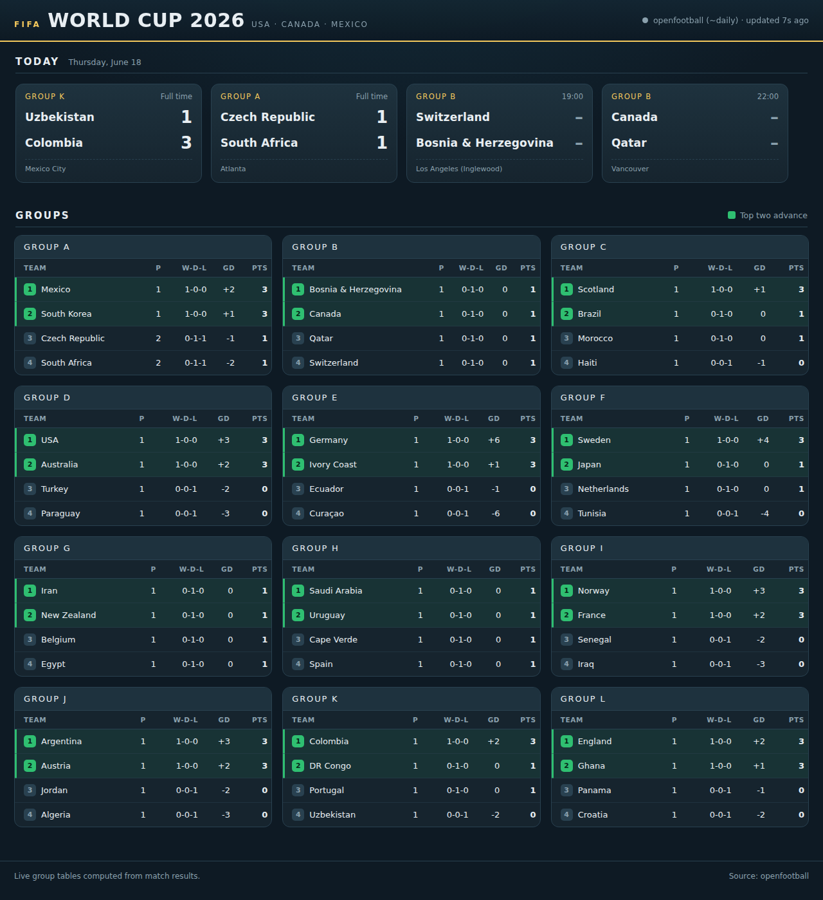
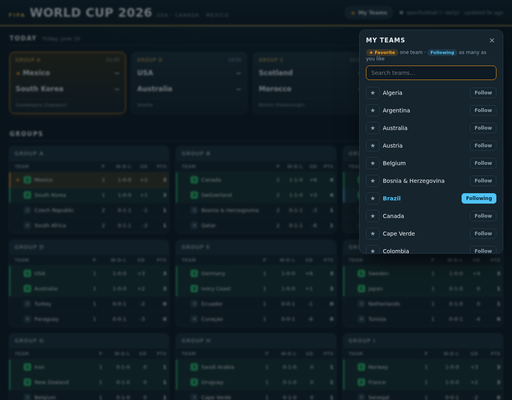
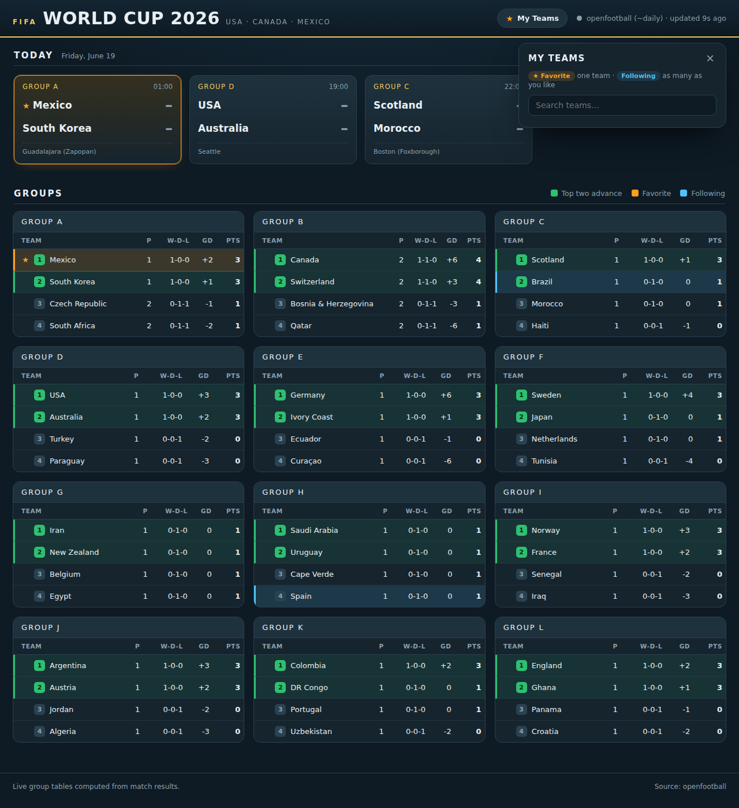

# World Cup 2026 — Live Dashboard

A tiny, self-contained **macOS desktop dashboard** for the FIFA World Cup 2026
(USA · Canada · Mexico). It launches at login and stays running, showing:

- **Today's matches** across the top as live scorecards — like the score bug on
  a broadcast — refreshing every **30 seconds**.
- **All 12 group tables** below, recomputed **live** from match results and
  refreshing every **60 seconds**, with the **top two of each group highlighted
  in green** (the teams that advance).
- **Your teams**: pick **one favorite** (gold star + a warm amber row that also
  tints its match in today's strip) and **follow as many others** as you like
  (a cooler blue row). Both stand out above the rest while the green "advances"
  marker stays visible.

Python + Flask backend, a minimal vanilla-JS frontend, **no database**, and a
CSV cache so it keeps working offline. Free to run with **zero configuration and
zero cost**.

**Repository:** <https://github.com/rony-13/wc-2026-updates>



---

## Why it's built this way

| Requirement | How it's met |
|---|---|
| Free & live | Defaults to the public-domain **openfootball** dataset — no key, no cost. Optionally upgrades to **football-data.org** for faster live updates. |
| No database | Normalized matches live in memory; standings are computed on the fly. |
| Offline loading | Every successful fetch is written to `data/cache/*.csv`; a committed public-domain seed in `data/seed/` means it shows real fixtures on first run even with no network. |
| Secrets safe | API keys come only from a git-ignored `.env`. Nothing secret is ever committed, logged, or printed. |
| Starts at login | A macOS **LaunchAgent** runs it at login and keeps it alive. |

The backend polls the upstream source on a gentle schedule and **caches**; the
frontend polls only the *local* backend (every 30s / 60s) and always gets cached
data instantly. That decoupling is what keeps the UI snappy without ever hitting
an upstream rate limit.

---

## Quickstart (any platform)

```bash
git clone https://github.com/rony-13/wc-2026-updates.git
cd wc-2026-updates
python3 -m venv .venv && source .venv/bin/activate
pip install -r requirements.txt
python run.py
```

Then open <http://127.0.0.1:8765/> (it also opens automatically). That's it —
it runs fully free on the no-key data source.

## Install on macOS (start at login, stay running)

```bash
./scripts/install-macos.sh
```

This creates a virtual environment, installs dependencies, writes a `.env` from
the template, and registers a LaunchAgent at
`~/Library/LaunchAgents/com.worldcup.dashboard.plist` with `RunAtLoad` +
`KeepAlive`. The dashboard will now start every time you log in and reopen in
your browser.

To remove it:

```bash
./scripts/uninstall-macos.sh
```

---

## Configuration & API-key security

All configuration is via environment variables, read from a local `.env`
(copy it from `.env.example`):

```bash
cp .env.example .env
```

| Variable | Default | Purpose |
|---|---|---|
| `FOOTBALL_DATA_API_KEY` | _(empty)_ | Optional. Enables faster live updates via football-data.org. |
| `REFRESH_SECONDS` | `30` | How often the backend pulls from upstream. |
| `HOST` / `PORT` | `127.0.0.1` / `8765` | Server bind address. |
| `DISPLAY_TIMEZONE` | _(machine local)_ | IANA name (e.g. `America/New_York`) for kickoff times and "today". |
| `OPENFOOTBALL_URL` | GitHub raw URL | Override if you mirror the dataset. |

**The key never touches git.** `.env` is listed in `.gitignore`; only
`.env.example` (with blank values) is committed. The code reads the key from the
environment and never writes it to logs or the CSV cache. To get a free key
(10 requests/min), register at
<https://www.football-data.org/client/register>.

> With no key, the dashboard uses openfootball, which is updated roughly once a
> day — great for fixtures and results, but not second-by-second. Add a key for
> faster in-match updates. Either way it's free.

---

## How it works

```
            ┌─────────────── providers (fallback chain) ───────────────┐
            │  football-data.org (keyed)  →  openfootball (no key)      │
            └───────────────────────────┬──────────────────────────────┘
                                         │ normalized Match[]
                          ┌──────────────▼──────────────┐
   background scheduler → │  WorldCupService (in-memory) │ → CSV cache (offline)
       every REFRESH_SECONDS                             │       ▲
                          └──────────────┬──────────────┘       │ seed (committed)
                                         │ get_today / get_groups
                       ┌─────────────────▼─────────────────┐
   browser polls  →    │  Flask: /api/today  /api/groups    │
   (30s / 60s)         └────────────────────────────────────┘
```

- **Providers** (`app/providers/`) each return a normalized `Match` list, so
  adding a new source is one small file.
- **Standings** (`app/standings.py`) are computed from matches: 3/1/0 points,
  ordered by points → goal difference → goals for → name, top two flagged.
- **Store** (`app/store.py`) persists matches to CSV and falls back to the
  committed seed.
- **Service** (`app/service.py`) keeps state, refreshes on a schedule, and
  answers the two questions the UI asks.
- **Preferences** (`app/preferences.py`) persists your favorite + followed teams
  to a small JSON file — no database, no account.

### API endpoints

| Endpoint | Description |
|---|---|
| `GET /` | The dashboard page. |
| `GET /api/today` | Today's matches (and any in-progress match). |
| `GET /api/groups` | All 12 group tables with `qualifies` flags. |
| `GET /api/teams` | The 48 nations, for the team picker. |
| `GET` / `PUT /api/preferences` | Read / save your favorite + followed teams. |
| `GET /api/health` | Source and last-updated timestamp. |

---

## Pick your teams

Pick **one favorite** team and **follow as many others** as you like. Your
choices are highlighted across the whole dashboard and saved between restarts.

**1. Open the picker.** Click **★ My Teams** in the top-right of the title bar.

**2. Set your favorite.** Click the **★** next to a team to make it your
favorite. Picking a new favorite replaces the old one — you get exactly one.

**3. Follow other teams.** Click **Follow** next to any teams you want to track —
follow as many as you like. (A team can't be both your favorite and followed;
favoriting a team you already follow moves it over automatically.)



**4. See them on the board.** Your picks stand out everywhere:

- **Favorite** — a gold **★** and a warm amber row. When your favorite plays
  today, its scorecard at the top is tinted the same color.
- **Following** — a cooler blue row.
- A favorite or followed team that is also in the top two keeps its **green rank
  badge**, so "this is my team" and "this team advances" stay visible at once.



Your selection is saved on the backend in `data/cache/preferences.json` (no
database, no account) and persists across restarts.

---

## Tests

```bash
python tests/test_standings.py
```

Covers points, ranking, live-vs-scheduled handling, top-two flagging, and
knockout exclusion.

---

## A note on standings accuracy

Group order uses points → goal difference → goals scored → team name. The full
FIFA tie-break sequence also includes head-to-head results and disciplinary
(fair-play) points, which are intentionally **not** modeled here to keep the
logic simple and transparent. In the rare cases those deeper tie-breaks matter,
the displayed order may differ from the official table.

---

## Data sources & attribution

- **openfootball / worldcup.json** — public domain (CC0).
  <https://github.com/openfootball/worldcup.json>
- **football-data.org** — optional, free tier with registration.
  <https://www.football-data.org>

This project is not affiliated with or endorsed by FIFA, football-data.org, or
openfootball.

## Contributing

Issues and pull requests welcome — adding a new data provider is a great first
contribution (drop a file in `app/providers/` returning `Match[]` and add it to
the chain in `app/providers/__init__.py`).

## License

MIT — see [LICENSE](LICENSE).
